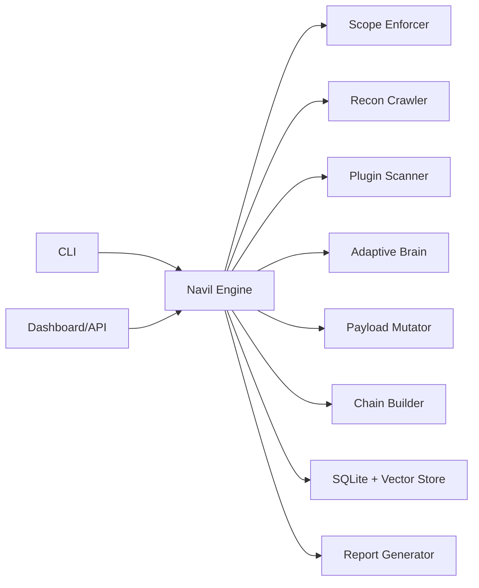

# Navil

Navil is an autonomous, scope-enforced application security assessment platform built for authorized testing workflows. It combines crawling, plugin-based vulnerability detection, adaptive strategy learning, exploit-chain modeling, API/CLI interfaces, and production-ready DevOps support.

## Legal Notice

Navil must only be used on systems where you have explicit permission to test.

## Core Capabilities

- Strict scope guardrails from `.navil-scope.yml`
- Async crawler with form/link discovery and technology fingerprinting
- 12 built-in vulnerability detectors
- Adaptive plugin prioritization engine (epsilon-greedy RL-style policy)
- Payload mutation pipeline with corpus + genetic evolution
- Chain analysis for multi-finding attack paths
- FastAPI API, WebSocket live feed, and modern dashboard UI
- Typer + Rich CLI for terminal-first operations
- Structured reporting (JSON, HTML, Markdown, PDF)
- CI/CD workflow, Docker runtime, automated tests
- Optional integrations: Burp export, Nuclei execution, Metasploit check mode

## Architecture Snapshot



## Quick Start

1. Install dependencies:

```bash
./scripts/setup.sh
```

2. Create scope file:

```bash
cp .navil-scope.example.yml .navil-scope.yml
```

3. Start API + dashboard:

```bash
uvicorn navil.api.server:app --host 0.0.0.0 --port 8080 --reload
```

4. Start a scan with CLI:

```bash
navil scan https://example.com --scope .navil-scope.yml --plugins headers,cors,info_disclosure
```

5. Generate report:

```bash
navil report --scan-id <SCAN_ID> --format html
```

## Dashboard

Open `http://localhost:8080` and provide your bearer token (default: `local-dev-token`).

## Testing and QA

```bash
pytest tests/ -v --cov=navil
ruff check navil tests scripts
mypy navil tests scripts
pip-audit
```

### Current QA Snapshot (2026-04-07)

- Tests: `12 passed`
- Coverage: `58%` total
- Lint: `All checks passed`
- Typing: `Success: no issues found in 100 source files`
- Dependency audit: `No known vulnerabilities found`
- Docker: build verified with `docker build -f docker/Dockerfile .`

Detailed QA process is documented in `docs/TESTING.md`.

## Documentation Map

- `docs/README.md`
- `docs/CREATION_GUIDE.md`
- `docs/ARCHITECTURE.md`
- `docs/IMPLEMENTATION.md`
- `docs/TESTING.md`
- `docs/RESEARCH.md`
- `docs/PRODUCT_PLAN.md`
- `docs/API.md`
