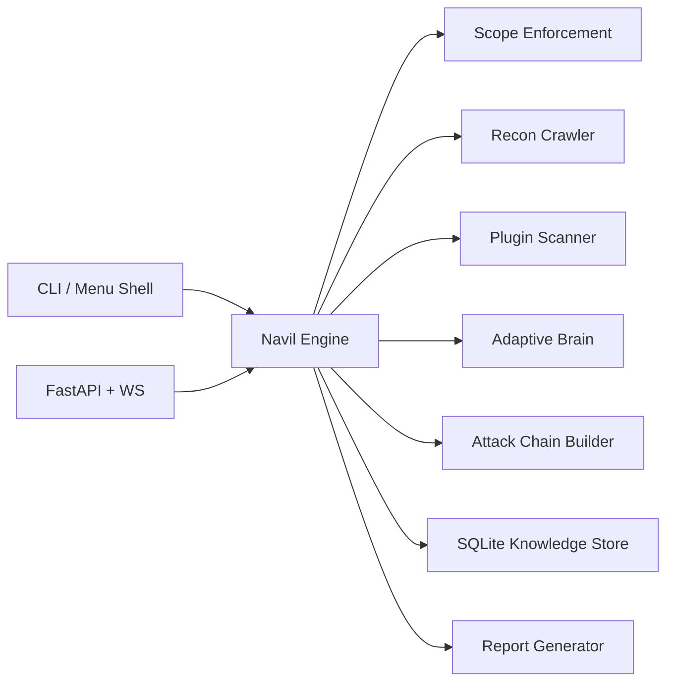

# Navil

Navil is an autonomous, scope-enforced application security assessment platform for authorized testing programs. It combines asynchronous crawling, plugin-based vulnerability detection, adaptive scan strategy, attack-chain modeling, and multi-format reporting in a terminal-first operator experience.

## Legal and Safety Notice

Use Navil only against assets where you have explicit written authorization to test.

## What Navil Delivers

- Strong scope enforcement from .navil-scope.yml before any scan action
- Async reconnaissance with link and form discovery
- Plugin-based detection pipeline for web security findings
- Adaptive brain that updates plugin priority from observed scan outcomes
- Attack-chain graphing for multi-step exploit narratives
- CLI-first operations with optional API + WebSocket surfaces
- JSON, HTML, Markdown, and PDF reporting outputs
- Local-first deployment with system Python and user-site install

## Operating Model: No Virtual Environments

This repository intentionally runs on real system Python.

- No venv setup path is supported
- Setup uses python3 and user-site package installation
- If your OS enforces externally managed Python, setup retries with --break-system-packages

Install once from repository root:

```bash
./scripts/setup.sh
```

Verify command availability:

```bash
python3 -m navil --help
navil --help
navel --help
```

If command shims are not found, add user scripts to PATH:

```bash
export PATH="$HOME/.local/bin:$PATH"
```

## Architecture Snapshot



## Quick Start

1. Install dependencies and CLI entrypoints:

```bash
./scripts/setup.sh
```

2. Create and validate scope file:

```bash
cp .navil-scope.example.yml .navil-scope.yml
navil scope validate .navil-scope.yml
```

3. Launch menu shell:

```bash
navil
```

4. Or run command mode directly:

```bash
navil scan https://example.com --scope .navil-scope.yml --plugins headers,cors,info_disclosure
```

5. Generate report after completion:

```bash
navil report --scan-id <SCAN_ID> --format html
```

## Interfaces

### Menu-Driven CLI

Launch:

```bash
navil
```

Equivalent explicit command:

```bash
navil start
```

Prompt style:

```text
navil [menu]> Option:
navil [Web Scan]> Option:
navil [System Audit]> Proceed [y/n]:
```

Menu shell characteristics:

- Uniform boxed panel layout for readability
- Action help panel before execution, with expected inputs and purpose
- Foreground live step-stream panels for long-running tasks
- Background job queue with inspect and cleanup flow
- History and scan presets for repeat operations

### Command-Driven CLI

Core command surface:

```bash
navil --help
navil scope validate .navil-scope.yml
navil scan https://example.com --scope .navil-scope.yml
navil report --scan-id <SCAN_ID> --format json
navil brain status
navil brain train --episodes 200
```

### API (Optional)

Start API server:

```bash
uvicorn navil.api.server:app --host 0.0.0.0 --port 8080 --reload
```

Default development token:

- local-dev-token

API reference:

- docs/API.md

## Standard Operator Workflow

1. Confirm authorization boundaries and scope policy.
2. Validate scope file.
3. Execute web scan in menu or command mode.
4. Inspect findings and chain potential.
5. Generate final report in required format.
6. Run policy training updates when needed.

## Troubleshooting

- Command not found:
  - Re-run ./scripts/setup.sh
  - Export PATH with ~/.local/bin
- Scope path is directory error:
  - Provide file path to .navil-scope.yml, not a directory
- API auth failures:
  - Send Authorization: Bearer local-dev-token (or configured token)

## Quality and Verification

Recommended validation sequence:

```bash
python3 -m ruff check .
python3 -m mypy navil
python3 -m pytest -q
```

## Documentation Map

- docs/README.md
- docs/CREATION_GUIDE.md
- docs/RUN_USAGE.md
- docs/API.md
- docs/ARCHITECTURE.md
- docs/IMPLEMENTATION.md
- docs/TESTING.md
- docs/RESEARCH.md
- docs/PRODUCT_PLAN.md
