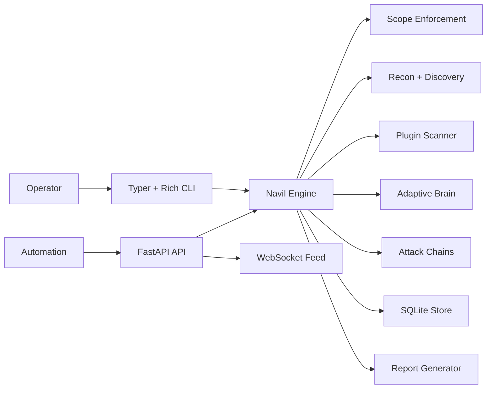
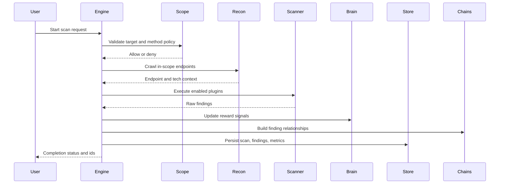

# Tech Stack and Architecture

This document explains how Navil components cooperate across CLI, API, scan orchestration, persistence, and reporting.

## 1. Stack Matrix

| Layer | Primary Components | Responsibility |
|---|---|---|
| Runtime | Python 3.11+, asyncio | async orchestration and I/O scheduling |
| Operator UI | Typer, Rich | command mode + interactive menu shell |
| Service API | FastAPI, Uvicorn, WebSocket | external automation and real-time event delivery |
| Core Engine | navil.core.engine | session lifecycle, scan coordination, state transitions |
| Scope Control | navil.scope | policy validation, domain/method/port/TLS controls |
| Recon | httpx, BeautifulSoup | endpoint discovery, parsing, fingerprinting |
| Scanner | plugin framework | detector execution and normalized findings |
| Learning | adaptive brain + replay memory | plugin prioritization from observed reward signals |
| Chains | networkx graph model | exploit-path chaining from findings |
| Persistence | SQLite via aiosqlite | scan state, findings, metadata retention |
| Reporting | Jinja2 + exporters | JSON/HTML/MD/PDF generation |
| QA & Delivery | pytest, ruff, mypy, CI | regression guardrails and repeatable delivery |

## 2. Runtime Topology

## 3. Scan Lifecycle

## 4. Control Boundaries

### 4.1 Scope Boundary

All scan activity is constrained by `.navil-scope.yml`.

- domains and paths
- methods
- TLS and ports
- depth and budget controls

### 4.2 API Boundary

`/api/*` routes require bearer auth. WebSocket streams are scan-id scoped.

### 4.3 Plugin Boundary

Plugins execute through a contract layer and return normalized finding objects.

## 5. Data Model Summary

Primary persisted entities:

- scan metadata and status
- findings with severity/category/plugin context
- metrics and timing summaries
- policy and model state snapshots

## 6. Operational Characteristics

- asynchronous network execution for scale efficiency
- non-destructive default plugin behavior
- local-first runtime with system Python installation model
- clear terminal ergonomics for menu operators

## 7. Failure Handling Strategy

- scope validation failures terminate early with explicit reason
- plugin execution faults are isolated and recorded
- background jobs preserve output/error state for later inspection
- report generation failures return actionable errors
