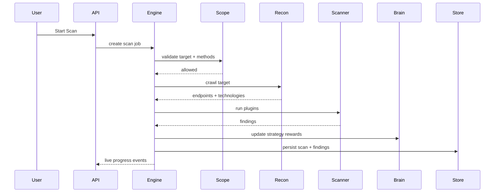

# Tech Stack and Architecture

## Stack

| Layer | Technologies |
|---|---|
| Runtime | Python 3.11+, asyncio |
| Desktop GUI | PyQt6 (native desktop client) |
| API | FastAPI, Uvicorn, WebSocket |
| CLI | Typer, Rich |
| Storage | SQLite (aiosqlite), local semantic vector store |
| Recon | httpx, BeautifulSoup |
| Scanning | Plugin architecture (12 detectors) |
| Learning | Adaptive epsilon-greedy policy + replay buffer |
| Mutation | Corpus + encoding strategies + genetic evolution |
| Chains | networkx attack graph |
| Reporting | Jinja2 + HTML/PDF/JSON/MD exporters |
| QA | pytest, ruff, mypy, pip-audit |
| Delivery | Docker, GitHub Actions |

## High-Level Flow

## Security Controls

- Hard scope enforcement on URL + method
- HTTPS and port restrictions from scope policy
- API bearer token authentication
- Structured audit-friendly logs
- Non-destructive default plugin behaviors
