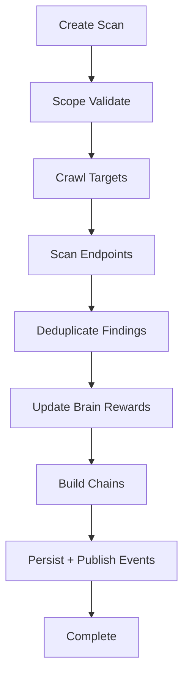

# Implementation Guide

## Repository Layout

- `navil/core`: orchestration, session lifecycle, scope enforcement
- `navil/recon`: crawling, form/link extraction, technology detection
- `navil/scanner`: plugin framework and built-in detectors
- `navil/brain`: adaptive policy updates and replay memory
- `navil/mutator`: corpus, encoders, genetic evolution
- `navil/chains`: graph-based chain modeling
- `navil/knowledge`: models + SQLite persistence + vector similarity
- `navil/api`: FastAPI routes, middleware, WebSocket feeds
- `navil/cli`: Typer command interface
- `navil/dashboard`: static web UI
- `navil/reporting`: templated export generation

## Engine Lifecycle

## Plugin Contract

Every plugin implements `VulnPlugin` with:

- `name`, `severity`, `category`
- `scan(context)` returning list of validated findings
- optional payload and verify helpers

## Third-Party Integration Model

- Burp export: normalized issue JSON
- Nuclei adapter: optional CLI invocation wrapper
- Metasploit adapter: non-interactive check wrapper

Integrations are optional and degrade gracefully when binaries are unavailable.
