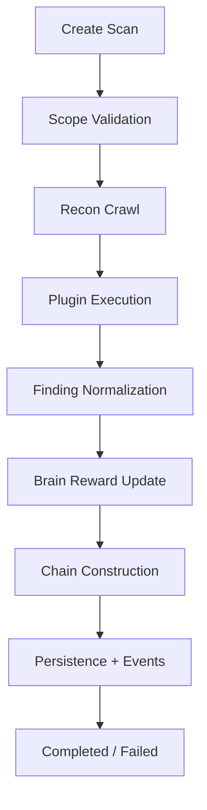

# Implementation Guide

This guide documents code-level structure and implementation contracts for extending Navil safely.

## 1. Repository Layout

- `navil/core`: orchestration, state transitions, scan lifecycle
- `navil/recon`: crawling, endpoint discovery, parsing logic
- `navil/scanner`: plugin abstraction and detector execution
- `navil/brain`: adaptive prioritization state and reward updates
- `navil/mutator`: payload generation and mutation strategies
- `navil/chains`: attack graph composition and relation logic
- `navil/knowledge`: persistence models and SQLite store
- `navil/api`: FastAPI routes, middleware, and websocket event APIs
- `navil/cli`: Typer commands and interactive menu shell
- `navil/reporting`: report templates and format exporters

## 2. Engine Lifecycle Contract

Lifecycle invariants:

- no scan proceeds before scope validation passes
- findings are normalized before reporting/storage
- errors are captured in scan state for operator visibility

## 3. Plugin Contract

All scanner plugins should expose:

- identity metadata (`name`, `severity`, `category`)
- `scan(context)` implementation returning normalized findings
- optional helper methods for payload generation and response verification

Plugin quality criteria:

- deterministic output shape
- low false-positive bias
- no destructive default behavior
- scope-respecting request generation

## 4. Menu Shell and Job Model

The interactive menu shell provides:

- action help + proceed confirmations
- foreground execution streams
- background queue via in-process thread pool
- persisted history and scan preset state

Background job implementation tracks:

- job id, status, timestamps
- result payload or error text
- inspect/cleanup ergonomics for operators

## 5. Persistence Contract

Core persistence entities:

- scan metadata and status progression
- findings and associated plugin/severity metadata
- metrics and error summaries

Recent scan retrieval supports report generation flows and menu-assisted selection.

## 6. Reporting Contract

Supported report formats:

- JSON
- HTML
- Markdown
- PDF

Exporter goals:

- consistent finding schema across formats
- clear metadata for downstream ingestion
- deterministic output paths when explicit output is provided

## 7. Integration Adapters

Optional adapters (Burp/Nuclei/Metasploit) must degrade gracefully when binaries are unavailable.

Adapter design expectations:

- explicit capability checks
- structured errors instead of hard crashes
- normalized adapter output into Navil finding/report model

## 8. Engineering Guardrails

- preserve scope-first enforcement semantics
- maintain typed interfaces (mypy clean)
- keep lint/test gates green before merge
- avoid hidden side effects in plugin and engine codepaths
